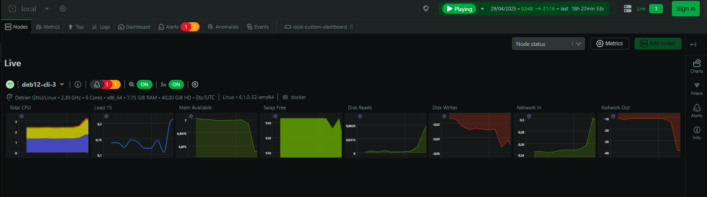
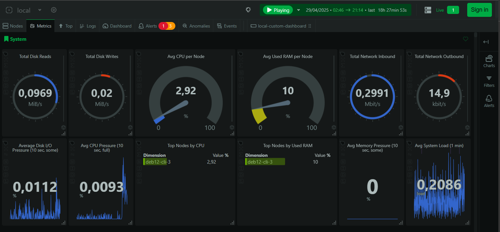

# Netdata

Guia oficial: [netdata.cloud/docker](https://learn.netdata.cloud/docs/netdata-agent/installation/docker)


### Docker compose

```
mkdir -p /usr/local/netdata/etc
```

```
version: '3'

services:
  netdata:
    image: netdata/netdata:stable
    container_name: netdata
    pid: host
    network_mode: host
    restart: unless-stopped
    cap_add:
      - SYS_PTRACE
      - SYS_ADMIN
    security_opt:
      - apparmor:unconfined
    volumes:
      - /usr/local/netdata/etc:/etc/netdata
      - netdatalib:/var/lib/netdata
      - netdatacache:/var/cache/netdata
      - /:/host/root:ro,rslave
      - /etc/passwd:/host/etc/passwd:ro
      - /etc/group:/host/etc/group:ro
      - /etc/localtime:/etc/localtime:ro
      - /proc:/host/proc:ro
      - /sys:/host/sys:ro
      - /etc/os-release:/host/etc/os-release:ro
      - /var/log:/host/var/log:ro
      - /var/run/docker.sock:/var/run/docker.sock:ro
      - /run/dbus:/run/dbus:ro

volumes:
  netdatalib:
  netdatacache:
```

### Acesso
Via web: `<IP>:19999`


## Configuração de plugins

Após a adição de monitoramentos é necessário reiniciar o serviço do Netdata executando o comando abaixo:

```
docker exec -it netdata sh -c 'netdatacli shutdown-agent'
```

### Notificação via Discord

 - Channel webhook: https://support.discord.com/hc/en-us/articles/228383668-Intro-to-Webhooks
 - https://learn.netdata.cloud/docs/alerts-&-notifications/notifications/agent-dispatched-notifications/discord

```
cd /usr/local/netdata/etc
nano ./edit-config health_alarm_notify.conf
```

```
END_DISCORD="YES"  
DISCORD_WEBHOOK_URL="https://discord.com/api/webhooks/XXXXXXXXXXXXX/XXXXXXXXXXXXXXXXXXXXXXXXXXXXXX"  
DEFAULT_RECIPIENT_DISCORD="alerts"
```


#### Ping / ICMP

 - https://learn.netdata.cloud/docs/collecting-metrics/synthetic-checks/ping

```
cd /usr/local/netdata/etc
./edit-config go.d/ping.conf
```

```
jobs:
  - name: "ICMP Google"
    hosts:
      - google.com
    network: ip4
    autodetection_retry: 3
    interval: 120
    privileged: yes

  - name: "ICMP Singapura DNS"
    hosts:
      - 203.126.118.38
    network: ip4
    autodetection_retry: 3
    interval: 120
    privileged: yes```
```


#### DNS query

 - Verificar plugin de DNS em https://learn.netdata.cloud/docs/collecting-metrics/dns-and-dhcp-servers
 - Man de como implementar o plugin: https://learn.netdata.cloud/docs/collecting-metrics/dns-and-dhcp-servers/dns-query


```
cd /usr/local/netdata/etc
./edit-config go.d/dns_query.conf
```

```
update_every: 1
autodetection_retry: 3

jobs:
 - name: DNS-1.1.1.1-A
   record_types:
     - A
   domains:
     - google.com
     - uol.com.br
   servers:
     - 1.1.1.1
 - name: DNS-8.8.4.4-A
   record_types:
     - A
   domains:
     - google.com
     - uol.com.br
   servers:
     - 8.8.4.4
     - 203.126.118.38
 - name: DNS-Singapura-A
   record_types:
     - A
   domains:
     - google.com
     - uol.com.br
   servers:
     - 203.126.118.38
```


#### HTTP(S)

 - https://learn.netdata.cloud/docs/collecting-metrics/synthetic-checks/http-endpoints
 - https://github.com/netdata/netdata/tree/master/src/go/plugin/go.d/collector/httpcheck#readme

```
cd /usr/local/netdata/etc
./edit-config go.d/httpcheck.conf
```

```
jobs:
  - name: "HTTPS Google"
    url: https://google.com/
    status_accepted: [ 200, 204 ]
    tls_skip_verify: no

  - name: "HTTPS UOL.com.br"
    url: https://uol.com.br
    status_accepted: [ 200, 204, 302 ]
    tls_skip_verify: no
```


# Prints

### Lista de hosts 

Nessa lista pode ser adicionado alguns hosts para centralizar a visualização, mas há limitação na quantidade de hosts e requer conta Netdata.cloud.




### Visão geral - métricas do host



### Dashboard customizado: CPU e memória do host


### Dashboard customizado: CPU e memória dos containers (cgroups)


### Exemplo de notificação - Discord


